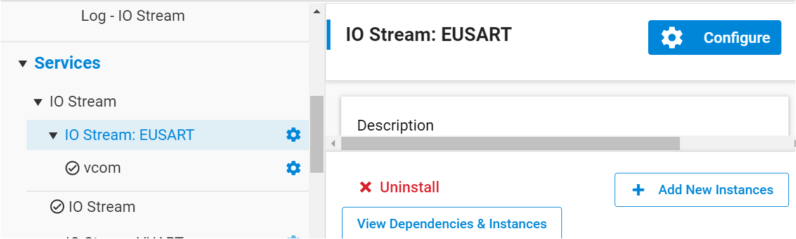
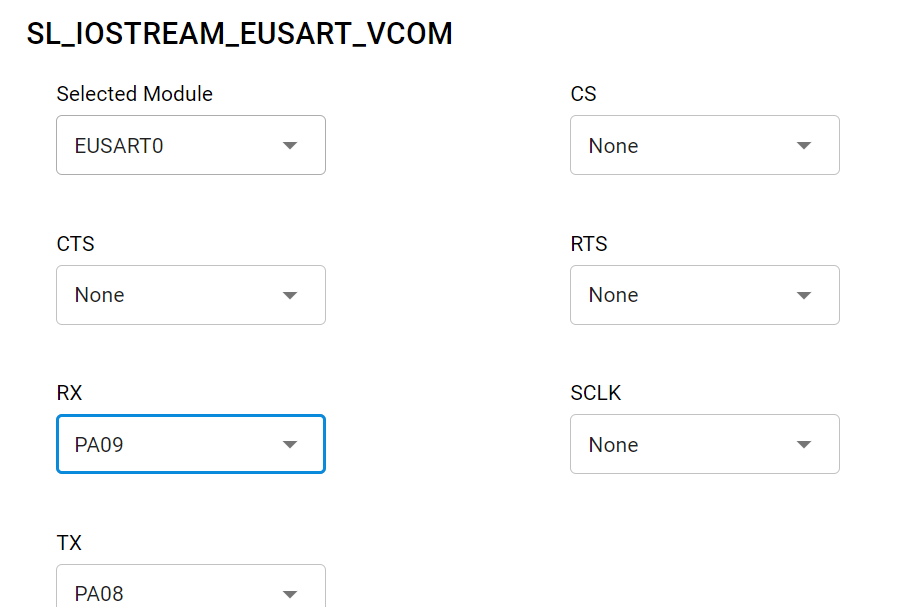
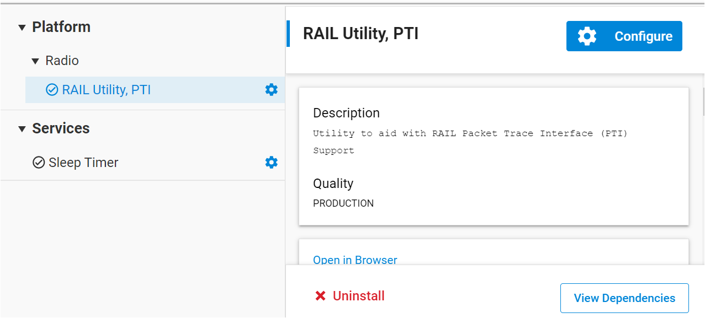
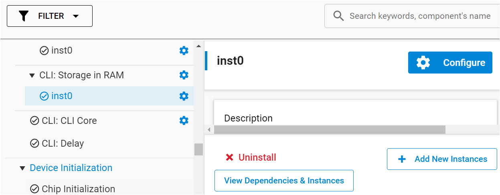
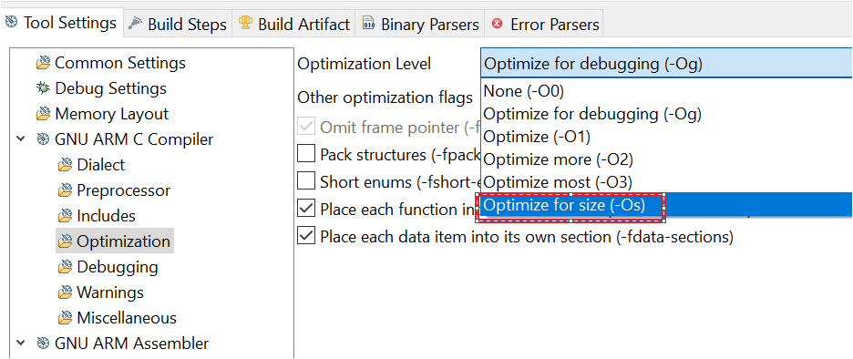

# How-To-Simplify-RAILtest-Sample-For-Low-Memory-MCU

## Overview

RAILtest sample project is very convenient to test RF performance, track the packet and send the data with protocol, but it is so heavy for some limited memory SOC, such as 128k flash MCU, So it is necessary to provide the lightweight RAILtest to customer only for RF performance test. This article will demonstrate how to simplify the RAILtest sample project to fit the EFR32FG14P231F128GM48 SOC.

## Hardware Required

- SOC: BRD4264C (EFR32FG23B020F512IM48)

## Software Required

- Flex SDK: Flex SDK V4.0.0
- IDE: Simplicity Studio V5   

## How to simplify the RAILtest sample project 

1. Create RAILtest example for custom board
    - Start Simplicity Studio V5, go to the **Simplicity IDE** perspective.
    - Click **Project**->**New**->**Silicon Labs Wizard...**
    - Choose the board or device(we choose EFR32FG23B020F512IM48 here), select the SDK version V4.0.0 and IAR or GNU ARM Toolchain, and then click the **NEXT**.
    - In the left Technology Type tab, choose the **Propriety**.
    - In the right example list, choose **Flex(RAIL)-RAILtest** example, and then click **NEXT**. You can modify the Project name and then click **FINISH**.

2. Add **vcom** component
    - Search **IO Stream** in software component search bar, find  **IO Stream:EUSART** install it and create a **vcom** instance, click **Done**. 
    
    - Click **Configure** to configure the vcom Pin definition, select the **EUASART0** moudle, Here I define the **PA08** as TX pin, and **PA09** as RX pin. CLK, CS and CTS are selected to **None**.
     

3. Uninstall unnecessary component
    - Uninstall PTI
      Search **PTI** in software component search bar, find the **RAIL Utility, PTI** component and unistall it.
        
    - Uninstall CLI RAM storage
      Search **RAM** in software component search bar, find the **CLI: Storage in RAM** component and unistall it.
      

4. Comment out unnessary cli command
Only reserve basic test command for RF performance, and ohters are commented out. Here is a table to list thoese necessary command.
    |Number|RAILtest command|Number|RAILtest command|
    |:----:|:---------------:|:----:|:-------------:|
    |1|    resetCounters   |17|    getVersion      |   
    |2|    rx              |18|    setRxOptions    |   
    |3|    tx              |19|    configTxOptions |   
    |4|    setFixedLength  |20|    setPower        |   
    |5|   getPower         |21|   getRssi          |  
    |6|   setTxTone        |22|   setTxStream      |    
    |7|   getStatus        |23|   setTxDelay       |   
    |8|   setTxPayload     |24|   getTxDelay       | 
    |10|  printTxPacket    |26|  startPerMode      |
    |11|  getPerStats      |27|  berConfigSet      |   
    |12|  berRx            |28|  berStatusGet      |  
    |13|  setCtune         |29|  getCtune          |   
    |14|  getChannel       |30|  setChannel        |   
    |15|  resetChip        |31|  getMemWord        |  
    |16|  setMemWord       |  |                    |

    Find the *sl_cli_command_table.c* file in auto_gen folder and replace it with [sl_cli_command_table.c](src/). Please note that this file will be overwriten if you do any change in radio configurator.

5. Comment out **power manager** component  
  Due to the **power manager** component can not be uninstalled by radio configurator, there it is required to manually uninstall it. 

    Find the *main.c* and modify the main function. 

    ```c
    while (1) {
    // Do not remove this call: Silicon Labs components process action routine
    // must be called from the super loop.
    sl_system_process_action();
    
    // Application process.
    app_process_action();
    
    #if defined(SL_CATALOG_POWER_MANAGER_PRESENT)
    // Let the CPU go to sleep if the system allows it.
    // sl_power_manager_sleep();  // should comment out here
    #endif
    }
    ```

    Find the *sl_event_hander.c* file and modify the *sl_platform_init* function as following

    ```C
    void sl_platform_init(void)
    {
      CHIP_Init();
      sl_device_init_nvic();
      sl_device_init_dcdc();
      sl_hfxo_manager_init_hardware();
      sl_device_init_hfxo();
      sl_device_init_clocks();
      sl_device_init_emu();
      // sl_power_manager_init(); // should comment out here
    }
    ```

6. Modifying link file to use entire flash   
   By default, xG23 will reserve the last page(size is 8K) for storing security related token. RAILtest don't need any security feature, so the last page should be used to store code.
   Find the **linkfile.ld** file in **autogen** folder and open it to modify as follow.

    ```C
    // Change the Length from
    MEMORY
    {
      FLASH   (rx)  : ORIGIN = 0x8000000, LENGTH = 0x7e000
      RAM     (rwx) : ORIGIN = 0x20000000, LENGTH = 0x10000
    }
    // to
    MEMORY
    {
      FLASH   (rx)  : ORIGIN = 0x8000000, LENGTH = 0x80000
      RAM     (rwx) : ORIGIN = 0x20000000, LENGTH = 0x10000
    }  
    ```
    **Note**
    The memory layout may be different between each part number chip, the length will be distinct, we need to do is that add 0x2000 size to **"LENGTH"**.

7. Further optimize  
Finally, we can modify the optimization level of complier to **-Os**(optmize for size) to further reduce the code size.
Right click project->**Properties**->**C/C++ bulid**->**Settings**->**GNU ARM Compiler**->**Optimization**    

## Test Result
Finally, the code size can be optimzed to ~122K, it is feasible to run on 128k chips.          
    
    

  


